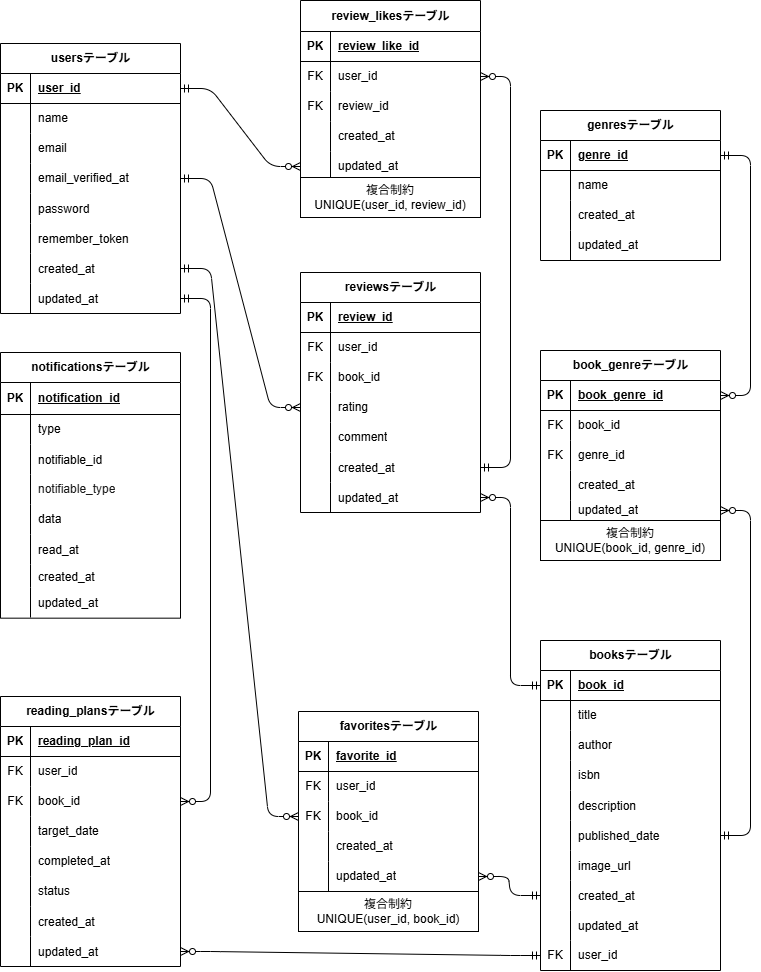

# COACHTECH Bookshelf 書籍レビューアプリ

## 概要

書籍レビューアプリケーション「BookShelf」です。
ユーザーは書籍を登録・閲覧し、レビューの投稿やお気に入り登録ができます。ジャンルによる分類やレビューへのいいね機能、平均評価に基づくランキング機能も備えています。外部アプリケーション向けの公開API（JSON）も提供します。

## 作成者

杉本有聡

## 使用技術

- PHP 8.5
- Laravel 10.50.2
- MySQL 8.4
- Docker / Docker Compose / Laravel Sail
- Vite / Tailwind CSS 3.4
- Laravel Fortify（認証）
- Sanctum 3.3
- phpMyAdmin

## ER図



## 開発環境URL

http://localhost/books

## 動作環境

- Docker
- Docker Compose

※ Windowsの場合はWSL2の利用を推奨します。

## 環境構築手順

### 1. リポジトリをクローン

```bash
git clone https://github.com/naoaki-png/Bookshelf.git
```

### 2. 依存パッケージのインストール

プロジェクト作成後、`Bookshelf` ディレクトリに移動し、依存パッケージをインストールします。

#### プロジェクトディレクトリに移動

```bash
cd Bookshelf
```

#### 依存パッケージをインストール

```bash
docker run --rm -u "$(id -u):$(id -g)" -v "$(pwd):/var/www/html" -w /var/www/html -e COMPOSER_CACHE_DIR=/tmp/composer_cache laravelsail/php82-composer:latest composer install
```

※M1/M2/M3 Mac（Apple Silicon）をお使いの方：
`sail up -d` 実行時に `no matching manifest for linux/arm64/v8` エラーが発生した場合、`compose.yaml` の `mysql` サービスに `platform: 'linux/amd64'` を追加してください。

### 3. .envファイルの準備

`.env.example` をコピーして `.env` を作成します。

```bash
cp .env.example .env
```

#### Google Books API キーの設定

書籍登録画面の **ISBN検索**は Google Books API を利用します。
`.env` の `GOOGLE_BOOKS_API_KEY` に API キーを設定してください。

```
GOOGLE_BOOKS_API_KEY=取得したAPIキー
```

キーは [Google Cloud Console](https://console.cloud.google.com/) で
Books API を有効化して発行します。

> [!NOTE]
> キーが未設定の場合、ISBN検索は「書籍情報の取得に失敗しました。」となります。
> **ISBN検索以外の機能（書籍の手動登録・レビュー・読書計画など）は
> キーが無くても動作します。**

### 4. Laravel Sailの起動

#### Sailコンテナの起動

```bash
./vendor/bin/sail up -d
```

#### エイリアスの設定

1. 毎回 `./vendor/bin/sail` と入力する手間を省くため、`sail` だけで実行できるようにエイリアスを設定します。

```bash
echo "alias sail='[ -f sail ] && bash sail || bash vendor/bin/sail'" >> ~/.zshrc
```

2. シェルを再起動するか、新しいターミナルを開いてエイリアスを有効にする

```bash
exec $SHELL
```

### 5. NPM依存パッケージのインストール

```bash
sail npm install
```

### 6. アプリケーションキーの生成

```bash
sail artisan key:generate
```

### 7. データベースのマイグレーションと初期データ投入

以下のコマンドでテーブルを作成し、ダミーデータを投入します。

```bash
sail artisan migrate:fresh --seed
```

※コンテナ内にデータが残っており、エラーが生じているケースなどがあります。 その場合は、以下のコマンドを順に実行して各コンテナを再起動して下さい。

```bash
sail down -v
```

```bash
sail up -d
```

```bash
sail artisan migrate:fresh --seed
```

初期データは以下の順で投入されます（`DatabaseSeeder`）。

```
User → Genre → Book → ReadingPlan → Review → Favorite → ReviewLike
```

外部キーの依存関係があるため、この順序で実行する必要があります。
最後に通知バッチ（`reading-plans:remind`）が実行されます。

### 8. Vite開発サーバーの起動

```bash
sail npm run dev
```

### 9. アプリケーションへのアクセス

ブラウザで[http://localhost/books](http://localhost/books)にアクセスします。

### 10. ログイン

初期データに以下のユーザーが登録されています。

| 名前     | メールアドレス        | パスワード |
| :------- | :-------------------- | :--------- |
| 山田太郎 | yamada@example.com    | password   |
| 鈴木花子 | suzuki@example.com    | password   |
| 田中一郎 | tanaka@example.com    | password   |
| 佐藤美咲 | sato@example.com      | password   |
| 高橋健太 | takahashi@example.com | password   |

> [!TIP]
> **読書計画と通知は 山田・鈴木・田中 の3名にのみ登録されています。**
> 動作確認は `yamada@example.com` が分かりやすいです。

## テスト実行

```bash
sail artisan test
```

## 通知機能について

読書計画のリマインダー通知は、期日の3日前・当日・3日後に送信されます。
本来は日次バッチ（`app/Console/Kernel.php`）で自動実行されますが、
**Sail のコンテナには cron が入っていないためスケジュールは動作しません。**

そのため `migrate:fresh --seed` の最後で通知バッチを1回実行し、
初期データとして通知が作られるようにしています。

手動で再実行する場合:

```bash
sail artisan reading-plans:remind
```

基準日を変えて動作を確認することもできます:

```bash
sail artisan reading-plans:remind --date=2026-09-10
```

## 機能一覧

- ユーザー認証（登録、ログイン、ログアウト）
- 書籍登録・更新・削除・検索
- 書籍詳細・レビュー評価（登録・更新・削除）・レビューに対していいね機能
- 読書計画登録・更新・削除
- ジャンル管理登録・更新削除
- ランキング表示
- 書籍お気に入り登録・削除
- マイレポート表示

## APIエンドポイント一覧

| HTTPメソッド | URI                  | 概要                                                                           |
| :----------- | :------------------- | :----------------------------------------------------------------------------- |
| GET          | /api/v1/books        | 書籍一覧 (検索・ページネーション付き)                                          |
| GET          | /api/v1/books/{book} | 書籍詳細                                                                       |
| POST         | /api/v1/books        | 書籍の新規登録（Sanctum）                                                      |
| PUT          | /api/v1/books/{book} | 書籍更新（Sanctum + BookPolicy（所有者のみ））                                 |
| DELETE       | /api/v1/books/{book} | 書籍削除（Sanctum + BookPolicy（所有者のみ））                                 |
| POST         | /api/v1/login        | ログイン。メールアドレスとパスワードで認証し、アクセストークン（Bearer）を発行 |
| POST         | /api/v1/logout       | ログアウト。使用中のアクセストークンを失効（Sanctum）                          |
